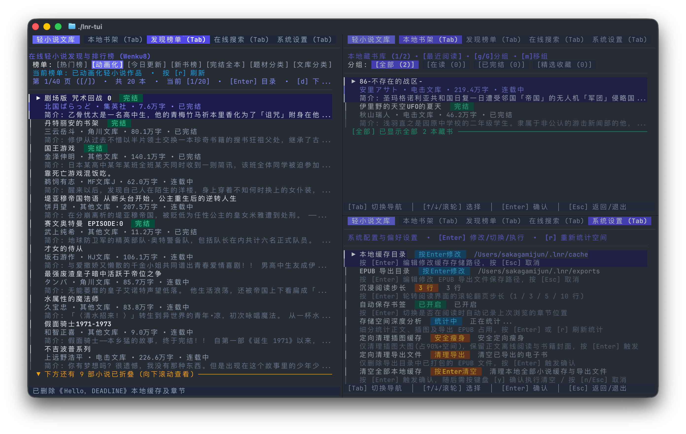

<div align="center">
  <h1>LNOVEL_TUI (LNR)</h1>
  <p><strong>极简、现代且高性能的跨平台轻小说终端阅读与下载工具</strong></p>
  
  
  
  
  
  
  
  <br /><br />
  
</div>

`LNOVEL_TUI (lnr)` 是一款专为轻小说爱好者与极客打造的跨平台终端阅读与资源管理工具。本项目采用严格的整洁架构（Clean Architecture）设计，基于 Go 语言原生并发与流式处理机制构建，彻底摒弃臃肿的 Electron/Webview 技术栈，在微秒级响应与极低内存占用下，为您提供现代排版的沉浸式终端阅读体验与工业级 EPUB 导出能力。

---

## 核心架构与特性

### 1. 双轨协同表现层
- **命令行 CLI (`lnr`)**：基于 Cobra 构建，支持精准搜索、书籍详情检索、分卷并发下载、EPUB 打包、榜单浏览与 Shell 自动补全，专为脚本自动化与极速操作优化。
- **终端交互 TUI (`lnr-tui`)**：基于 Bubble Tea 与 Lipgloss 构建，响应式自适应终端尺寸，提供高对比度现代暗色主题、键盘高效导航与流畅的窗口切片体验。

### 2. 极致性能与流式处理管道
- **零内存堆积**：核心包全链路采用流式传输与动态复用（`sync.Pool` 缓冲池复用、GB18030/UTF-8 字符集流式转码、流式 ZIP/EPUB 写入）。
- **进程级零开销**：CLI 与 TUI 作为同级表现层直接消费领域模型（`model.BookDetail`、`model.Volume` 等），杜绝子进程调用与标准输出正则解析。
- **界面严谨利落**：界面与输出中严禁使用任何 Emoji 符号，统一采用高对比度的专业文本标签（如 `[本地书架]`, `[在线搜索]`, `[探索榜单]`, `[偏好设置]`）。

### 3. 沉浸式终端阅读引擎
- **排版与对齐**：支持东亚字符宽度自适应对齐、段落缩进、智能断行与文本格式化清洗（支持全角省略号/破折号智能规范化与广告词过滤）。
- **繁简即时转换**：阅读界面按 `t` 键即时在简体中文与繁体中文之间无缝切换。
- **断点记忆书签**：自动精准记录阅读进度与行号，下次进入书籍瞬间无感续读。
- **多套阅读主题**：内置经典墨黑、柔和暖调、护眼青黛等终端色彩方案。

### 4. 终端原生插图预览与快速查看
- **协议自适应**：原生适配 Kitty 图形协议、iTerm2 图像协议与 Sixel 标准，在支持的终端内直接高质量内联渲染插图。
- **系统级预览**：macOS 环境下一键调起系统原生 QuickLook 独立高分辨率窗口。

### 5. 工业级流式 EPUB 导出
- **颗粒度分卷打包**：支持全本打包或单卷/多卷独立分册打包。
- **图文选项分离**：支持完整图文打包，亦支持生成纯文本轻量版本。
- **标准电子书标准**：生成的 EPUB 3.0 规范文件兼容 Apple Books、Calibre、Kindle 及各大主流墨水屏阅读器。

### 6. 本地书架与空间精细治理
- **多维书架管理**：支持多分组分类、书籍置顶、智能多字段排序（最近阅读/字数/完结状态）。
- **连载追踪同步**：联网一键批量轮询书架追更状态，自动同步最新分卷章节。
- **深度存储分析**：可视化细分正文、插图与已导出 EPUB 占用，支持“仅清理插图缓存（安全释放90%+空间，保留封面与正文）”的定向瘦身策略。

---

## 系统架构设计规范

```
                    ┌─────────────────────────────────────────┐
                    │               用户表现层                 │
                    └────────────────────┬────────────────────┘
                                         │
                    ┌────────────────────┴────────────────────┐
                    ▼                                         ▼
           【CLI 命令行交互】                         【TUI 终端交互】
             cmd/lnr/main.go                          cmd/lnr-tui/main.go
            (Cobra 命令解析)                           (Bubble Tea 响应式视图)
                    │                                         │
                    └────────────────────┬────────────────────┘
                                         │ 直接调用 Go 原生 API 与 Channel
                                         ▼
                    ┌─────────────────────────────────────────┐
                    │             pkg/ 核心能力底座            │
                    ├─────────────────────────────────────────┤
                    │ pkg/source:     多源抓取引擎与解析器      │
                    │ pkg/storage:    本地缓存与书架分组持久化  │
                    │ pkg/downloader: 低内存流式并发下载引擎   │
                    │ pkg/epub:       标准 EPUB 打包构建引擎   │
                    │ pkg/reader:     终端排版与阅读书签记录   │
                    │ pkg/text:       正则清洗与繁简转换引擎   │
                    │ pkg/image:      终端原生图像渲染与预览   │
                    │ pkg/version:    语义版本管理与更新探测   │
                    └─────────────────────────────────────────┘
```

---

## 部署与安装

### macOS 一键安装 (Homebrew)

```bash
brew tap SakagamiJun/tap
brew trust SakagamiJun/tap
brew install lnr
```
*(注：根据 Homebrew 安全更新，首次安装第三方 Tap 需执行 `brew trust SakagamiJun/tap`)*

安装完成后，系统将全局提供 `lnr`（CLI）与 `lnr-tui`（TUI）两个独立指令。

### 预编译二进制下载 (GitHub Releases)

前往 [Releases 页面](https://github.com/SakagamiJun/lnovel_tui/releases) 下载适用于您系统的预编译归档包：
- macOS (Apple Silicon / Intel)
- Linux (x86_64 / ARM64)
- Windows (x86_64)

解压后即可直接执行。

### Go 语言原生安装

若本地已配置 Go 1.25+ 环境：
```bash
go install github.com/SakagamiJun/lnovel_tui/cmd/lnr@latest
go install github.com/SakagamiJun/lnovel_tui/cmd/lnr-tui@latest
```

### 源码编译

```bash
git clone https://github.com/SakagamiJun/lnovel_tui.git
cd lnovel_tui
make build
```
编译生成的二进制位于 `bin/lnr` 与 `bin/lnr-tui`。

---

## 快速上手

### 1. 终端交互阅读器 (TUI)

直接启动交互式终端客户端：
```bash
lnr-tui
```

#### 全局快捷键导航

| 快捷键 | 功能操作 | 说明 |
| :--- | :--- | :--- |
| `Tab` / `Shift+Tab` | 切换主功能标签 | 【本地书架】/【探索榜单】/【在线搜索】/【偏好设置】 |
| `↑` / `↓` 或 `k` / `j` | 上下移动光标 | 浏览列表项目与菜单配置 |
| `Enter` | 确认进入 | 进入小说目录、打开章节阅读或执行操作 |
| `Esc` | 返回上一级 | 从阅读界面返回目录，退出确认，取消对话框 |
| `q` | 退出程序 | 在书架/主界面按 `q` 安全退出程序 |
| `Ctrl+C` | 强制终止 | 任意界面随时安全退出 |

#### 阅读界面快捷键

| 快捷键 | 功能操作 | 说明 |
| :--- | :--- | :--- |
| `j` / `k` 或 `↓` / `↑` | 逐行平滑滚动 | 依据设置中的行步长滚动视口 |
| `Space` / `PageDown` | 向下翻页 | 快速浏览下一屏幕正文 |
| `b` / `PageUp` | 向上翻页 | 快速浏览上一屏幕正文 |
| `[` / `]` | 跨章节跳转 | 快速翻阅上一章节或下一章节 |
| `t` | 繁简转换切换 | 实时在简体中文与繁体中文正文间切换 |
| `c` | 切换主题配色 | 轮转墨黑、柔和暖色、青黛等配色体系 |
| `i` | 查看内嵌插图 | 唤起终端插图模态框与高清预览 |
| `Esc` | 退出阅读 | 自动记录当前阅读位置与书签 |

---

### 2. 命令行工具 (CLI)

```bash
# 1. 搜索小说 (按书名或作者)
lnr search "关于我转生变成史莱姆这档事"
lnr search "伏濑" -a

# 2. 查看小说详情与分卷目录
lnr info 4340

# 3. 浏览文库大赏与全站榜单
lnr top anime
lnr top allvisit

# 4. 下载小说离线缓存 (支持全本或指定分卷)
lnr download 4340               # 下载全部已上线章节与插图
lnr download 4340 --volume 1    # 仅下载第 1 卷

# 5. 导出符合工业标准的 EPUB 电子书
lnr export 4340 -o ./slime_complete.epub
lnr export 4340 --volume 1 -o ./slime_vol1.epub
lnr export 4340 --split-volume -o ./dist/       # 批量按卷分册导出
lnr export 4340 --no-images -o ./slime_text.epub # 纯文字轻量导出

# 6. 书架联网更新状态同步
lnr update

# 7. 查看版本与详细构建信息
lnr version
lnr --version

# 8. 生成 Shell 自动补全脚本
lnr completion zsh > ~/.zfunc/_lnr
```

---

## 质量保障与自动化测试

运行全量单元测试与并发竞态检测：
```bash
make test
```

---

## 鸣谢与生态致敬

- [Charmbracelet](https://charm.sh/) - 打造了令人惊艳的现代终端交互基础库（`bubbletea`, `lipgloss`, `bubbles`）。
- [Wenku8](https://www.wenku8.net/) - 提供优质的轻小说书目元数据与数字排版资源。
- [Cobra](https://github.com/spf13/cobra) - 赋能 Go 语言一流的命令行交互结构设计。

---

## 开源协议

本项目基于 MIT 协议进行开源分发。详见 [LICENSE](LICENSE) 获取完整条款。
